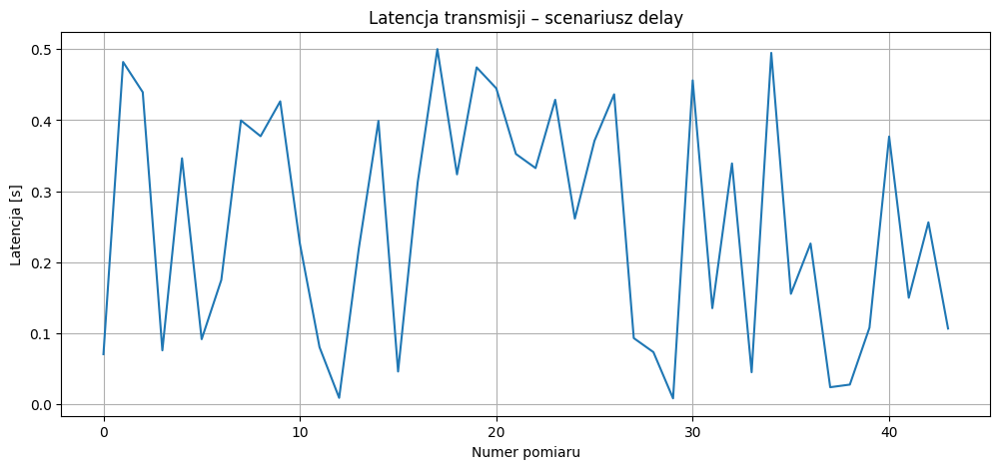
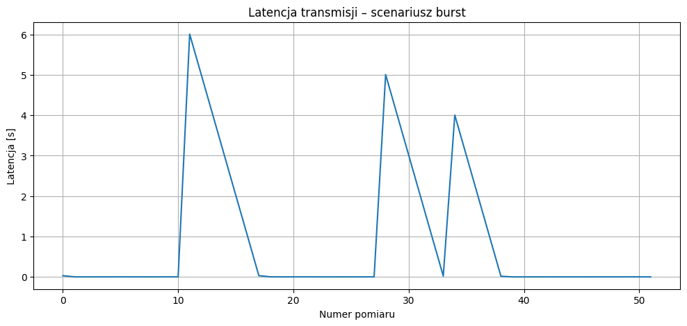
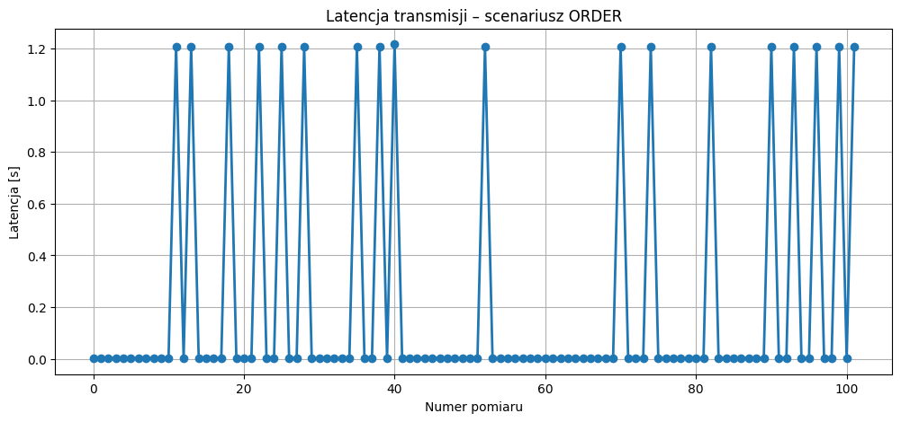
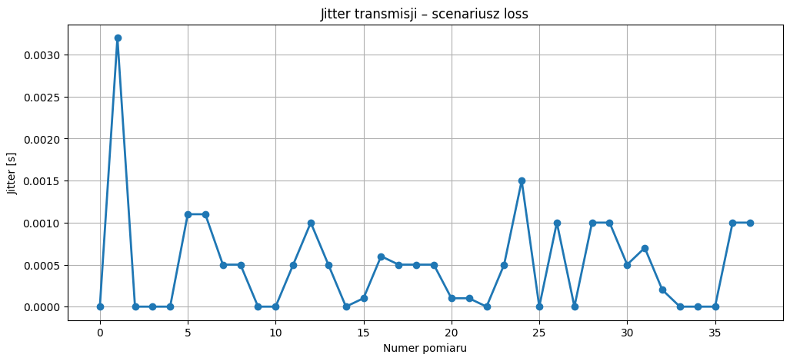

# System monitoringu parametrów w czasie rzeczywistym.
**Autorki:** Amelia Supernak, Milena Żebrowska
**Przedmiot:** Rozwój aplikacji internetowych w medycynie
**Rok studiów:** 3
**Prowadząca:** dr inż. Anna Jezierska

## Logo uczelni

## Logo katedry

---
# 1. Analiza potrzeb i wymagań klinicznych
* **Identyfikacja problemu:** Monitorowanie tętna (BPM) w czasie rzeczywistym jest kluczowe dla wykrywania nagłych zdarzeń, takich jak tachykardia, bradykardia czy asystolia. Opóźnienia w transmisji danych (latency) mogą opóźnić reakcję personelu medycznego o krytyczne sekundy.

### Użytkownicy systemu
- lekarze,
- pielęgniarki,
- personel oddziałów intensywnej terapii,
- personel techniczny nadzorujący systemy medyczne.

### Analiza ryzyk
- **Opóźnienia transmisji** – dane docierają za późno i nie odzwierciedlają aktualnego stanu pacjenta.
- **Jitter** – nieregularność dostarczania próbek utrudnia płynną analizę sygnału.
- **Utrata pakietów** – może prowadzić do fałszywych alarmów o braku sygnału (asystolii), co wywołuje tzw. "alarm fatigue" (znieczulica na alarmy) u personelu.
- **Przeciążenie systemu (backpressure)** – może prowadzić do spowolnienia odbioru danych i pogorszenia działania monitoringu.

---

## 2. Projekt architektury systemu

System został podzielony na trzy główne moduły:

### 1. Generator danych
Generator odczytuje dane z pliku i wysyła je do serwera z częstotliwością 1 Hz.  
Dane nie są wyłącznie odtwarzane – każda próbka może zostać lekko zmodyfikowana, np. przez dodanie zakłócenia.

### 2. Backend API
Backend odbiera próbki danych przez interfejs API, zapisuje je w pamięci oraz oblicza podstawowe parametry, np. opóźnienie transmisji.

### 3. Frontend
Frontend pobiera dane z API i przedstawia je na wykresie w czasie rzeczywistym.

### Schemat działania
`plik danych -> generator -> API -> backend -> frontend`

---

# 3. Etap 1 – działająca funkcjonalność minimalna (API-first)

W ramach etapu 1 zaimplementowano minimalną działającą wersję systemu zgodnie z podejściem API-first.

### Założenia etapu 1
- streaming danych z częstotliwością 1 Hz,
- wykorzystanie danych pochodzących z pliku,
- modyfikacja danych przed wysłaniem,
- odbiór danych przez backend za pomocą API,
- wizualizacja danych na wykresie w czasie rzeczywistym.

---
# 4. Etap 2 – symulacja zaburzeń transmisji

Celem drugiego etapu projektu była analiza wpływu zaburzeń transmisji danych na działanie systemu monitoringu parametrów pacjenta w czasie rzeczywistym.

## Założenia etapu 2
- wysyłanie danych z symulacją opóżnienia,
- wysyłanie danych z symulacją burst,
- wysyłanie danych z symulacją reorderu danych,
- pomiar latencji i jitter, wypisanie pomiaru w terminalu oraz zapisanie do pliku,
- raport z pomiarów.

## Zaimplementowane scenariusze zaburzeń

### 1. Symulacja opóźnień transmisji (Delay)

W scenariuszu delay dane są wysyłane z losowym opóźnieniem czasowym.  
Pozwala to zasymulować problemy sieciowe oraz zwiększoną latencję transmisji.

W projekcie zastosowano losowe opóźnienia przed wysłaniem pakietu danych do backendu.
Plik:
`gen_delay.py`

## Wykres opóźnień

---

### 2. Symulacja burst danych

W scenariuszu burst dane są chwilowo buforowane, a następnie wysyłane jednocześnie w większej liczbie.

Pozwala to zasymulować chwilowe przeciążenie systemu oraz zjawisko backpressure.

Plik:
`gen_burst.py`

## Wykres burst danych

---

### 3. Symulacja reorder pakietów
W scenariuszu reorder dane są wysyłane w nieprawidłowej kolejności.

Pozwala to sprawdzić wpływ błędnej kolejności pakietów na działanie systemu monitorującego.

Plik:
`gen_order.py`

## Wykres reorder pakietów

---

### 4. Symulacja utraty pakietów

W scenariuszu packet loss część pomiarów jest celowo pomijana podczas transmisji.

Pozwala to zasymulować problemy sieciowe prowadzące do utraty danych.

Plik:
`gen_loss.py`

## Wykres utraty 

---
# 5. Instrumentacja i pomiary

W systemie zaimplementowano mechanizmy monitorujące parametry transmisji danych.

## Mierzone parametry

- latencja transmisji,
- jitter,
- liczba odebranych pomiarów,
- maksymalne opóźnienie.

## Logowanie danych

Pomiary:
- wyświetlane są w terminalu,
- zapisywane są do pliku `measurement_report.csv`.

Backend oblicza opóźnienie transmisji na podstawie różnicy pomiędzy czasem wysłania danych przez generator a czasem odebrania danych przez serwer.

---

# 6. Raport z pomiarów

Podczas testów zaobserwowano, że:
- scenariusz burst powoduje największe chwilowe opóźnienia,
- jitter zwiększa się przy nieregularnych odstępach wysyłania danych,
- utrata pakietów prowadzi do brakujących próbek,
- reorder powoduje odbieranie danych w błędnej kolejności.

System poprawnie rejestrował zaburzenia oraz umożliwiał analizę wpływu problemów transmisyjnych na monitoring pacjenta.

---
# 7. Instrukcja uruchomienia

 ## Uruchomienie backendu komendą w terminalu: 
  python server.py

 ## Uruchomienie generatora podstawowego komendą w terminalu: 
  python generator.py

 ## Uruchomienie scenariuszy zaburzeń:
 - python gen_delay.py
 - python gen_burst.py
 - python gen_order.py
 - python gen_loss.py

## 8. Struktura repozytorium

RAIM-main/
├── assets/
├──
│   ├── pg_logo.png
│   └── kib.png
├── data/
│   └── patient_001.csv
├── static/
│   └── index.html
├── gen_delay.py
├── gen_burst.py
├── gen_order.py
├── gen_loss.py
├── measurement_report.csv
├── generator.py
├── server.py
├── requirements.txt
└── README.md